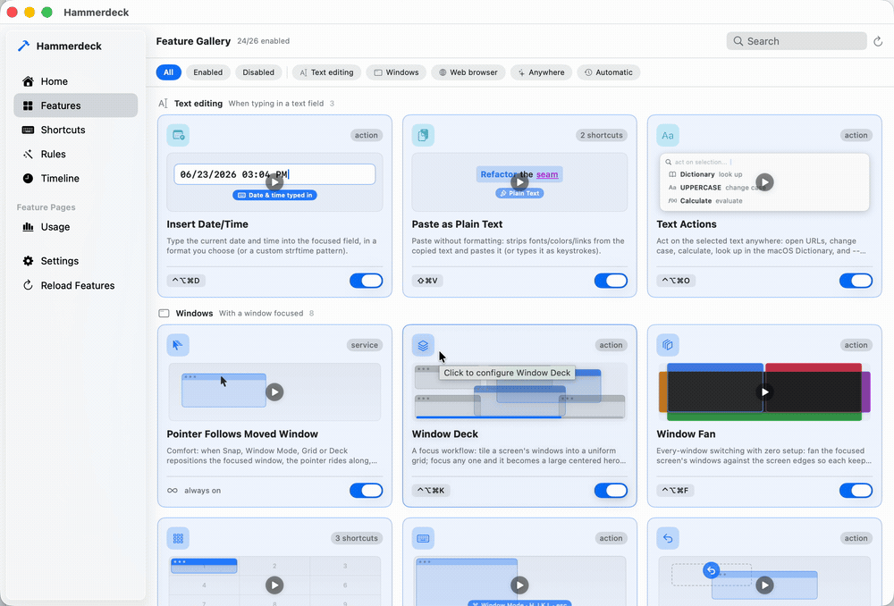
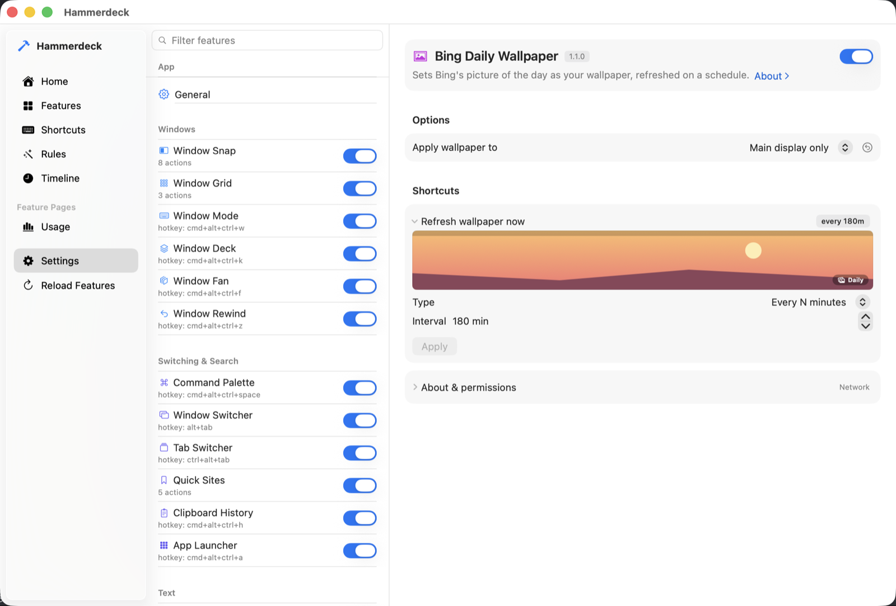

# Hammerdeck

**Big screens, many screens, no dragging.**

macOS tiles in halves and quarters. That is the right answer on a laptop and the
wrong one on a 49-inch ultrawide -- and across two or three displays there is no
keyboard shortcut at all, at any macOS version, to send a window to the other
display or to swap what sits on each.

Hammerdeck puts all of it on keys: **arbitrary grids** (name two corners),
**throws and swaps between displays**, a **deck** that keeps every window
reachable, a **modal layer** for arranging by feel, and **one-key undo** for any
of it -- each on a hotkey or a **chord** (`cmd+shift+a`, then `b`). Then it does
the same thing without you: a **rules engine** reacts to the Mac itself, so
connecting a display rearranges your windows instead of you doing it again.
Actions that read your live window stay on keys by design; the ones that need no
context -- refresh the wallpaper, open a set of tabs -- also take **a schedule or
a system event**.

It is a native Swift app with a Lua engine inside -- think a focused, miniature
Hammerspoon -- except you never write Lua. Every feature is a switch, some
options, and a trigger picker.

And it is automation you can **see**: every shortcut press flashes which action
fired, automated runs can notify you of what happened while you were away, one
hotkey rewinds the last window rearrangement, and every decision lands in a
local, plain-text log. Open source and local-first -- no account, no cloud, no
subscription.

<p align="center">
  
</p>

<p align="center"><em>Every feature is a card. Hover it to see what it does, flip the switch to
turn it on, and the badge shows the shortcut it is bound to.</em></p>

## Features

<!-- FEATURES:BEGIN (generated by scripts/gen-readme-features.py -- do not edit by hand) -->

A feature ships **off** unless its row says *on by default* -- those work from a fresh install. Switch on whatever else you want in Settings and bind it to any trigger.

### Windows

- **Window Snap** *(on by default)* -- Move the focused window from the keyboard: throw it to the next display and the pointer rides along, snap to a half, toggle maximize/75%, or land on a rectangle you saved -- plus a one-shot swap of two displays' windows. No macOS version through 26 has a display-move shortcut; beyond Sequoia's halves and quarters this adds the 75% toggle, your own placements, and undo through Window Rewind -- from macOS 13.
- **Window Grid** *(on by default)* -- Precise placement: put the focused window into a grid cell -- or a rectangle spanning several. A hotkey deems the screen a grid (Hyper+9 = 3×3, Hyper+4 = 2×2, Hyper+6 = a 6-cell grid that orients to the screen -- 3×2 wide, 2×3 tall); press a cell to land there, or a second cell down-right of it to fill that rectangle.
- **Window Mode** *(on by default)* -- Fine control, one key at a time: a modal keyboard layer for move/resize/corners/center/undo, live until Escape. For arranging by feel without spending a global hotkey on every arrangement.
- **Window Deck** *(on by default)* -- A focus workflow: tile a screen's windows into a uniform grid; focus any one and it becomes a large centered hero, the rest peeking behind. ⌥Esc drops the hero, then exits.
- **Window Fan** *(on by default)* -- Every-window switching with zero setup: fan the focused screen's windows against the screen edges so each keeps a full, always-visible edge no other window can cover. Click any one to switch. Turn the rearranging off and nothing on screen moves -- the borders, the list and the switching stay. With it on, the fan declines to run when a screen holds more windows than it can honestly fit, and says how many that is.
- **Window Rewind** *(on by default)* -- Undo for any window move: one hotkey (Hyper+Z) restores every window a snap, screen-swap, grid, or deck move just repositioned, and returns the pointer with them. Single-step -- it rewinds the most recent change.
- **Pointer Follows Moved Window** *(on by default)* -- Comfort: when Snap, Window Mode or Grid repositions the focused window, the pointer rides along, keeping its place inside it. Multi-window layouts -- Deck, Fan, and rules -- deliberately leave the pointer where it is.

### Visibility & Trust

- **Confirm Shortcut Presses** *(on by default)* -- When you fire a feature with a hotkey or chord, briefly flash which action ran -- a quiet, single-slot chip (glyph + name, top-center) that fades on its own. Confirms the press registered and, if you reached for the wrong shortcut, shows what you actually triggered. Automated triggers use the separate notification instead.
- **Notify on Automated Run** *(on by default)* -- Show a brief on-screen notification naming a feature when one of its actions fires from an AUTOMATED trigger -- a schedule or a system event (sleep/wake/screen lock/...). Lets you see what ran while you were away. Manual shortcuts (hotkeys, chords) and menubar runs never notify -- you started those yourself.
- **Usage Stats** -- Tracks wake/sleep sessions and per-app focus time to daily CSV files (idle time excluded), with an optional desktop widget. <sub>Reaches: reads browser tabs, reads/writes files.</sub>

### Switching & Search

- **Command Palette** -- Fuzzy-search and run any action of any enabled feature from one keystroke. <sub>Reaches: runs other features.</sub>
- **Window Switcher** -- Searchable Alt-Tab: switch windows across all apps, most recently used first.
- **Tab Switcher** -- Searchable switcher across all Chrome + Safari tabs, most recently used first, with favicons. <sub>Reaches: reads browser tabs, network, reads/writes files.</sub>
- **Quick Sites** -- Jump to a favorite site -- focuses its tab if it's already open, opens it if not. Per site, pick the browser, a Chrome profile, and whether it opens as a standalone app window, a fresh private window, or both. cmd+<number> jumps straight to a row in the picker, and every site is also a menubar row you can give its own shortcut. <sub>Reaches: reads browser tabs, network, reads/writes files.</sub>
- **Clipboard History** -- Keeps a searchable history of copied text; pick an entry to paste it. Password-manager entries are never recorded. <sub>Reaches: types keystrokes, reads/writes files.</sub>
- **App Launcher** -- Launch or focus any installed app from a searchable panel -- found by a plain disk scan, never Spotlight indexing. <sub>Reaches: sees installed apps.</sub>

### Text

- **Insert Date/Time** -- Type the current date and time into the focused field, in a format you choose (or a custom strftime pattern). <sub>Reaches: types keystrokes.</sub>
- **Paste as Plain Text** -- Paste without formatting: strips fonts/colors/links from the copied text and pastes it (or types it as keystrokes). <sub>Reaches: types keystrokes.</sub>
- **Text Actions** -- Act on the selected text anywhere: open URLs, change case, calculate, look up in the macOS Dictionary, and -- with an OpenAI key -- refine/translate/summarize via AI. Results paste back in place. <sub>Reaches: types keystrokes, network.</sub>

### Health

- **Break Reminder** -- Reminds you to rest your eyes after a work interval; idle-aware, with daily work-time stats. <sub>Reaches: sleep/lock.</sub>
- **Sleep Schedule** -- Forces system sleep at a set time, with graduated warnings, a one-time snooze, and a weekend shift. <sub>Reaches: sleep/lock.</sub>
- **Turn Off Display When Idle** -- Turns the display off after a period of no activity, with a countdown warning on every screen first. Stands down while video, a call or a presentation is holding the display awake. <sub>Reaches: sleep/lock.</sub>

### Utilities

- **Countdown** -- Ask for minutes, then run a thin progress strip along the bottom of the screen; notifies when time is up.
- **Password Generator** -- Generate a strong random password and copy it to the clipboard.
- **Pointer** -- On-demand pointer helpers -- flash a crosshair to find the mouse, or center it on the focused window or a screen.

### Appearance

- **Bing Daily Wallpaper** -- Sets Bing's picture of the day as your wallpaper, refreshed on a schedule. <sub>Reaches: network.</sub>

<!-- FEATURES:END -->

Beyond the catalog, the **rules engine** wires features together -- built in
Settings, no code. A rule pairs a **signal** (frontmost app, displays connected,
an app launches or quits, light/dark appearance, power source) with **effects**:
move windows to a saved
layout, run any feature's action, set the wallpaper, lock the screen, launch or
quit an app, or chain several together. And where the built-in effects end, a
rule can run any macOS Shortcut -- the escape hatch to everything else.

Past the first-party catalog, **extensions** are your own features: point
Settings > General at a folder and every `<id>/lua/init.lua` inside it loads
next to the built-ins, with the same manifest contract, the same scoped API,
the same capability gate, and the same quarantine (a broken one shows as a red
row, it never takes the app down). Reload picks up your edits without a
relaunch.

Writing one need not be a solo job. Switch on **agent access** in
Settings > General and Hammerdeck serves a local, token-guarded
[MCP](https://modelcontextprotocol.io) endpoint on the loopback interface, so a
coding agent can inspect the catalog, see exactly which API a feature is handed,
reload after an edit, read the exact load error, and test-fire what it wrote --
the whole write-and-verify loop against the running app. The same panel copies
or exports the authoring guide as a ready-to-use agent skill, and that guide is
where the tools are listed.

It is off until you turn it on and reachable only from this machine. An agent
working through it can enable a feature in order to test-fire it. What that
feature may reach is not hidden: every one declares its capabilities in
`feature.json`, the app withholds anything undeclared at run time, and
`validate_extension` checks the declaration against what the code actually
calls, in both directions. One of the capabilities an extension can declare is
`exec` -- running another program -- and a program can do whatever you can, so
that declaration is the widest one on the list and says so in as many words.

This is auditability rather than a sandbox, which is a real distinction and not
a hedge: an extension you install is code you chose to run, and the point is
that its reach is written down and machine-checked instead of buried. There is
no tool for running arbitrary Lua -- eval'd code belongs to no feature, so there
is no declaration to check it against and nothing to withhold. `os.execute` and
`io.popen` are withdrawn from the embedded interpreter, so the ordinary way to
start a program is the declared, logged one. None of that adds up to
containment: a determined extension can still build code at runtime, and the
honest claim is that an accurate declaration is easy and an inaccurate one is
conspicuous.

## Install

**[Download the latest release](https://github.com/kouxing2000/hammerdeck/releases/latest)**
-- universal (Apple Silicon and Intel), macOS 13 or later. Every build is
attached to its release here, and
[hammerdeck.peach-studio.com](https://hammerdeck.peach-studio.com/) points at
the same file if you would rather have a page than a list. It is signed with a Developer ID
and notarized by Apple, so there is no "unidentified developer" wall -- macOS
still asks once whether to open an app downloaded from the internet. Open the
disk image and drag Hammerdeck to Applications; if you run it from somewhere
else it offers to move itself on first launch. That move is not housekeeping:
macOS runs a downloaded app from a randomised read-only path until it has been
moved, and an app running from there can never install its own updates.

It keeps itself up to date: Hammerdeck checks for new versions and asks you
before installing any of them.

Or build it from source:

```bash
git clone https://github.com/kouxing2000/hammerdeck.git
cd hammerdeck
swift build && swift run
```

A hammer icon appears in the menubar. Click it to fire any enabled feature's
actions; **Settings…** opens the config window -- toggles, options, and trigger
binding for every feature.

**First run starts empty.** Nothing is enabled and no hotkey is taken: a Feature
Tour previews each one and you add the ones you want. Nothing runs that you did
not switch on.

## Bind it to anything

Options and triggers are **generated from the feature's own declaration** -- there is no
per-feature settings code, and no config file to hand-edit. Any action can be driven by a
hotkey, a chord, a schedule, or a system event.

<p align="center">
  
</p>

## Permissions

Many features run with **no macOS permission at all**. The ones that need one
ask only when you first use them:

<!-- PERMISSIONS:BEGIN (generated by scripts/gen-readme-features.py -- do not edit by hand) -->

- **Accessibility** -- to read or move windows, act on the current selection, or press keys on your behalf: Window Snap, Window Grid, Window Mode, Window Deck, Window Fan, Window Rewind, Pointer Follows Moved Window, Window Switcher, Clipboard History, Insert Date/Time, Paste as Plain Text, Text Actions, Break Reminder, Pointer.
- **Automation** -- features that read browser tabs drive Chrome and Safari through AppleScript, so macOS prompts once per browser: Usage Stats, Tab Switcher, Quick Sites.
- **Automation (System Events)** -- switching the system between dark and light goes through System Events, so macOS prompts once, the first time a rule does it: the rules engine (Switch to dark, Switch to light, Toggle dark mode).

<!-- PERMISSIONS:END -->

- **An OpenAI key** (yours, stored in the Keychain) -- only for Text Actions' AI
  transforms. Everything else in that feature works without one.

No permission is requested up front, and a feature you never enable never asks.

## Build & test

```bash
swift build              # CLua (vendored Lua 5.4.7) + the host
swift run                # run the app
lua test/run.lua         # headless Lua/feature tests (fast inner loop)
scripts/test-lua.sh      # the same suite on the vendored 5.4.7 -- run before committing Lua
scripts/test-swift.sh    # integration tests against the real Swift<->Lua bridge
scripts/check-lua-types.sh   # LuaLS over the workspace at Error level
```

`swift test` is not only for Swift changes: two integration tests read the live
on-disk catalog, so adding or renaming a feature can turn it red.

`defaults delete Hammerdeck` resets everything to first-run.
Boot without grabbing hotkeys: `HAMMERDECK_NO_FIRSTRUN=1 swift run`.

Current status and open work live in the
[issue tracker](https://github.com/kouxing2000/hammerdeck/issues).

## Design

A native Swift host and an embedded Lua engine, meeting at **one seam**.

The rule that protects every future option: **only the Swift bridge
(`app/platform/swift/LuaState.swift`, `Native.swift` and its
`Native+<domain>.swift` extensions) and `app/platform/lua/adapter.lua` may touch
native/OS APIs.** Everything else reaches
the OS through that seam, so the host stays swappable and a feature never sees the
backend it runs on.

A feature is a folder under `app/features/<id>/`: a `feature.json` (identity), a
`lua/` plugin, and optionally a `swift/` for native UI it contributes. It receives
a **scoped `ctx`** -- every handle it creates is tracked and torn down when it's
disabled. Features are autodiscovered; the Settings form is generated from the
feature's own typed options, so a new plugin gets its UI for free.

[`CLAUDE.md`](CLAUDE.md) is the full design reference: the layer map, the plugin
contract, and the build/test commands.

## Layout

```
Sources/
  CLua/                    vendored Lua 5.4.7 C source (see Sources/CLua/VENDOR.md)
  HammerdeckNotify/        ObjC shim for permission-free notifications
  Hammerdeck/main.swift    thin launcher -> hammerdeckMain()
app/                       co-located payload: Lua platform + host Swift + features
  hammerdeck.lua           entry point: autodiscovers features, binds enabled ones
  loader.lua               package.searcher: stable require names -> lua/ subfolders
  platform/
    lua/                   THE LUA PLATFORM
      adapter.lua          THE SEAM (Lua side) -- the only Lua file touching the host
      ctx.lua              the scoped, curated API a feature receives
      manifest.lua         manifest schema + validation
      triggers.lua         hotkey | chord | schedule | event -- any trigger, any action
      registry.lua         enabled features; lifecycle + scoped teardown
      rules / signals / effects       the automation engine
    swift/                 THE SWIFT HOST
      LuaState.swift       the Swift<->Lua bridge -- the seam (Swift side)
      Native.swift (+ Native+<domain>.swift)   the native.* table -- OS surface grows here
      StatusBar / SettingsView / *Panel.swift  menubar + config UI + panels
  features/<id>/           feature.json (identity) + lua/ (plugin) + swift/ (optional UI)
test/
  harness.lua              discovery + per-case isolation
  fake_adapter.lua         in-memory adapter (controllable clock)
  cases/                   one hermetic case file per feature
  run.lua                  the runner
```

## Contributing

Bug reports and fixes are very welcome; the feature catalog is curated and
first-party, so please open an issue before building a new one. See
[`CONTRIBUTING.md`](CONTRIBUTING.md).

## License

Copyright (C) 2026 kouxing2000.

Hammerdeck is free software under the **GNU General Public License v3.0** -- see
[`LICENSE`](LICENSE). You may use, study, modify, and redistribute it, but any
distributed derivative must also be released under the GPL, with its source.
Hammerdeck, and anything built from it, stays open.

### Third-party

- **Lua 5.4.7** (`Sources/CLua/`) -- vendored verbatim under its own **MIT**
  license (Copyright (C) 1994-2024 Lua.org, PUC-Rio); see
  [`Sources/CLua/VENDOR.md`](Sources/CLua/VENDOR.md). The GPL covers Hammerdeck's
  own code; the vendored Lua keeps its MIT terms.
- **Sparkle** (`Sparkle.framework`, embedded in the released app) -- the update
  framework, under its own **MIT** license: Copyright (c) 2006-2013 Andy
  Matuschak; 2009-2013 Elgato Systems GmbH; 2011-2014 Kornel Lesinski;
  2015-2017 Mayur Pawashe; 2014 C.W. Betts; 2014 Petroules Corporation; 2014 Big
  Nerd Ranch. Sparkle's `LICENSE` also carries the licenses of the components it
  bundles in turn.

Every one of these notices ships inside the app, in
`Hammerdeck.app/Contents/Resources/Licenses/`, alongside a copy of the GPL.
